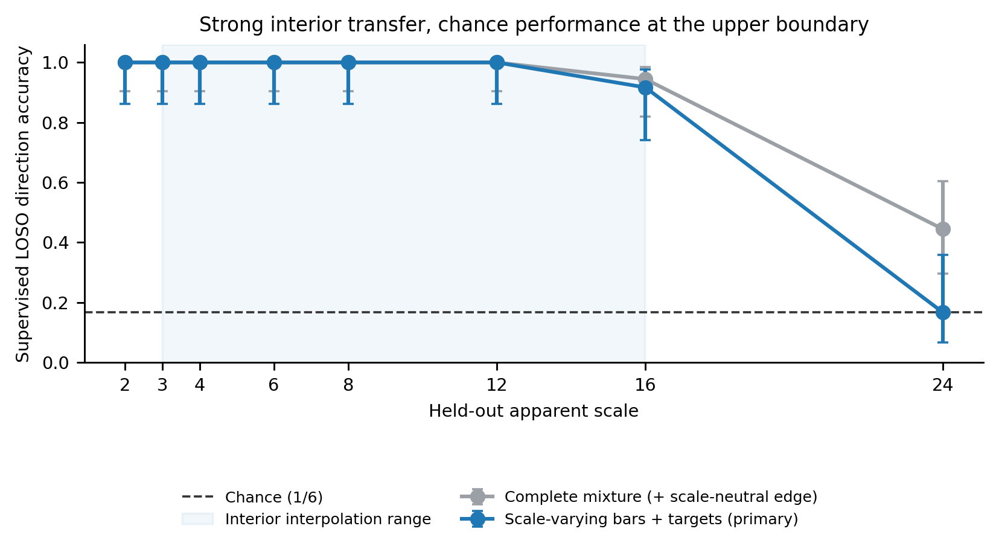
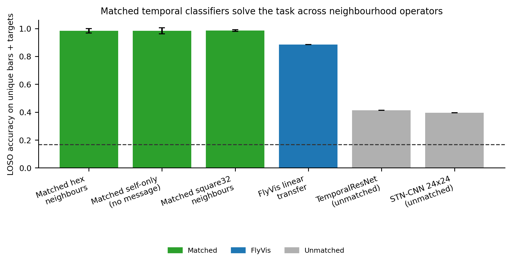
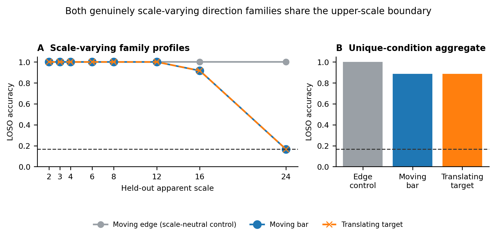
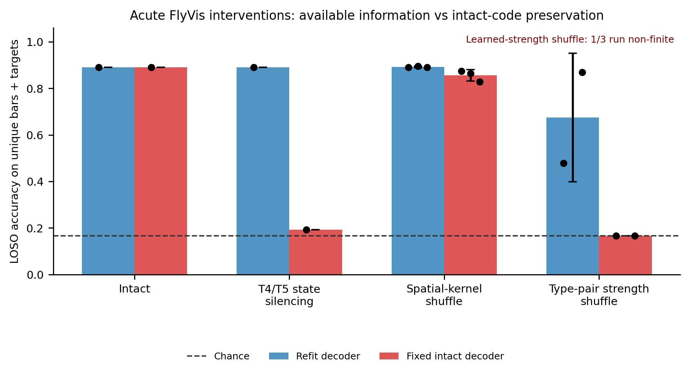

# ScaleBreak-FlyVis

ScaleBreak-FlyVis is a reproducible analysis toolkit for testing whether dynamic visual variables remain linearly decodable when retinal apparent scale changes. It supports pretrained FlyVis responses, leave-one-scale-out evaluation, matched temporal controls, circuit perturbations, uncertainty estimates, and figure generation.

## Included

- FlyVis-native hexagonal stimulus generation
- Frozen FlyVis response extraction
- Unique-condition and duplicate-repeat audits
- Interpolation and boundary-extrapolation summaries
- Collision audits for hex-to-square coordinate mappings
- Capacity- and sampling-matched temporal controls
- Direct T4/T5 and connectivity-parameter perturbations
- Linear probes, temporal diagnostics, RSA/CKA, and robustness controls
- PDF, SVG, and PNG figure exports

## Recent code updates

- Repeat seeds now drive position jitter and luminance noise in `11_generate_flyvis_native_stimuli.py`.
- Moving edges are marked as scale-neutral because changing their nominal scale does not alter rendered geometry.
- `42_audit_unique_conditions.py` detects duplicate renderings, recomputes uncertainty over unique conditions, and separates interpolation from boundary extrapolation.
- `43_matched_geometry_controls.py` compares hex-neighbour, collision-free square-neighbour, and self-only temporal models with matched inputs, capacity, splits, and optimization.
- `44_direct_flyvis_perturbations.py` re-simulates FlyVis after T4/T5 state silencing and two connectivity-parameter shuffles.
- `45_make_analysis_figures.py` regenerates the current figures with legends outside the plotting axes.

## Repository layout

```text
scalebreak_flyvis/
├── configs/          # analysis and stimulus configuration
├── figures/          # current PDF, SVG, and PNG exports
├── notebooks/        # exploratory notebooks
├── outputs/          # lightweight result tables and diagnostics
├── scripts/          # executable pipeline stages
├── src/scalebreak/   # reusable analysis modules
└── tests/            # smoke tests
```

## Installation

```bash
git clone https://github.com/nalin-dhiman/ScaleBreak-FlyVis.git
cd ScaleBreak-FlyVis

python -m venv .venv
source .venv/bin/activate
pip install -r scalebreak_flyvis/requirements.txt
```

The `flyvis` dependency and a locally cached FlyVis checkpoint are required only for scripts that simulate the pretrained network. Most table, plotting, and unit-test code does not require the checkpoint.

## Tests

```bash
PYTHONPATH=scalebreak_flyvis/src pytest scalebreak_flyvis/tests -q
```

## Core workflow

Generate FlyVis-native stimuli with independent seeded nuisance variation:

```bash
python scalebreak_flyvis/scripts/11_generate_flyvis_native_stimuli.py
```

Extract central-cell FlyVis responses:

```bash
python scalebreak_flyvis/scripts/12_run_flyvis_pilot_v2.py \
  --device cpu
```

Audit unique conditions, scale regimes, and coordinate mappings:

```bash
python scalebreak_flyvis/scripts/42_audit_unique_conditions.py
```

Train matched geometry controls:

```bash
python scalebreak_flyvis/scripts/43_matched_geometry_controls.py \
  --seeds 42,84,123
```

Run direct FlyVis perturbations:

```bash
python scalebreak_flyvis/scripts/44_direct_flyvis_perturbations.py \
  --checkpoints 000 \
  --seed 20260807
```

Regenerate the figure exports from saved result tables:

```bash
python scalebreak_flyvis/scripts/45_make_analysis_figures.py
```

Every command accepts `--help`. Large stimulus tensors, response arrays, checkpoints, and prediction-level files are intentionally ignored by Git.

## Current figures

All figures are available as vector PDF/SVG files and PNG previews under [`scalebreak_flyvis/figures`](scalebreak_flyvis/figures).

### Cross-scale transfer



### Matched temporal controls



### Feature-family profiles



### Direct FlyVis perturbations



## Data requirements

Full end-to-end execution requires:

- a local FlyVis data/checkpoint cache;
- generated native stimulus tensors and metadata;
- central-cell FlyVis response arrays;
- local connectome export tables for graph-specific analyses.

Paths can be changed through command-line arguments or files under `scalebreak_flyvis/configs/`. The default `.gitignore` keeps large arrays, checkpoints, environments, and caches out of version control.
